# 系统截图
### 登录页.png
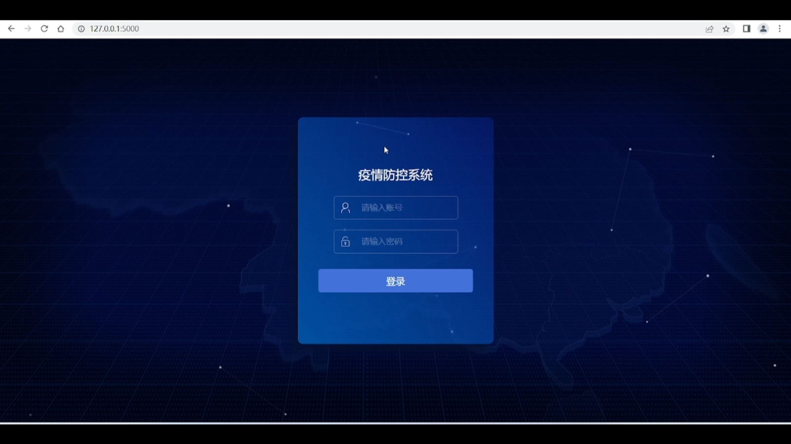
### 主页1.png
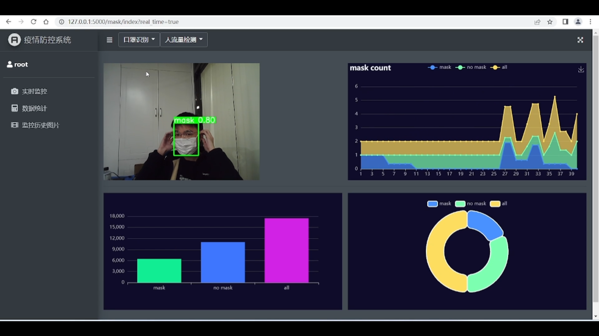
### 主页2.png
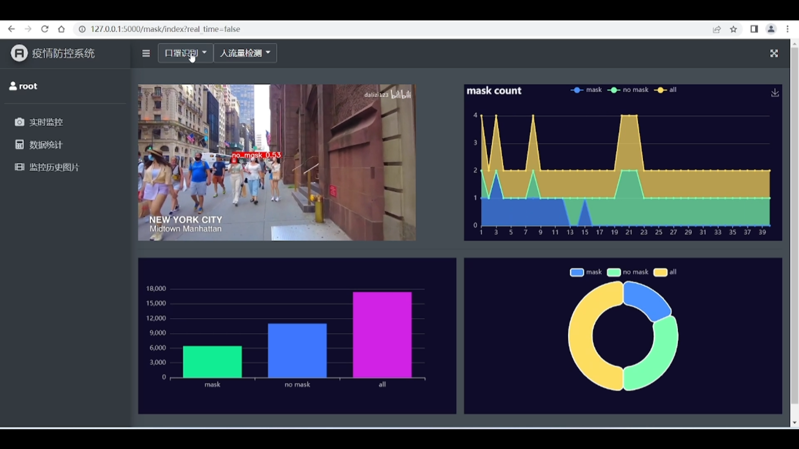
### 历史数据.png
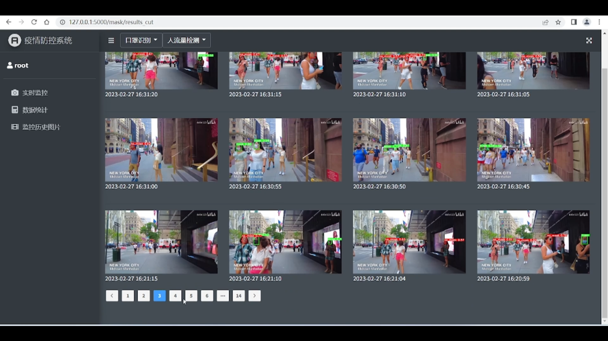
### 数据监控页面.png
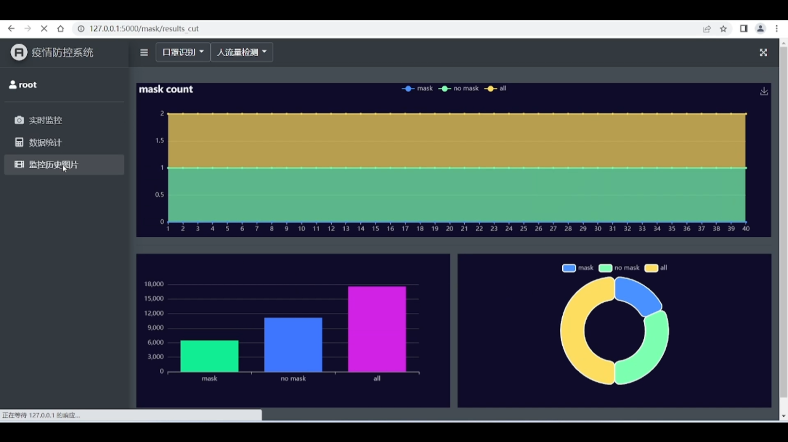

# 系统设计图
### er图.png
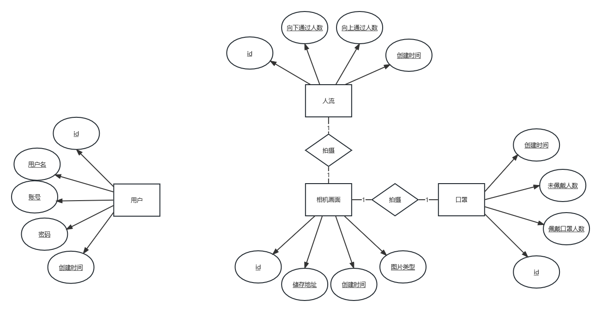
### 功能列表.png
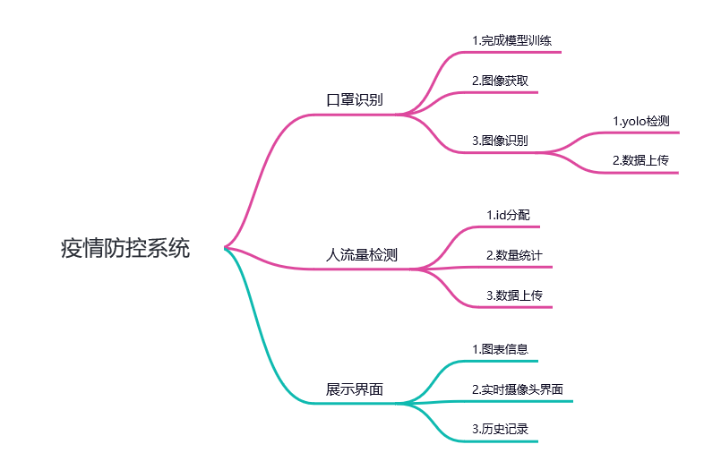
### 技术栈.png
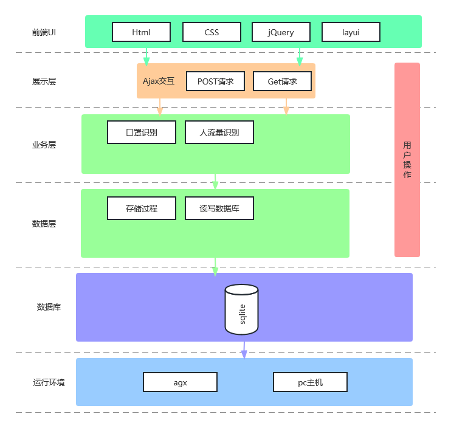
### 时序图.png
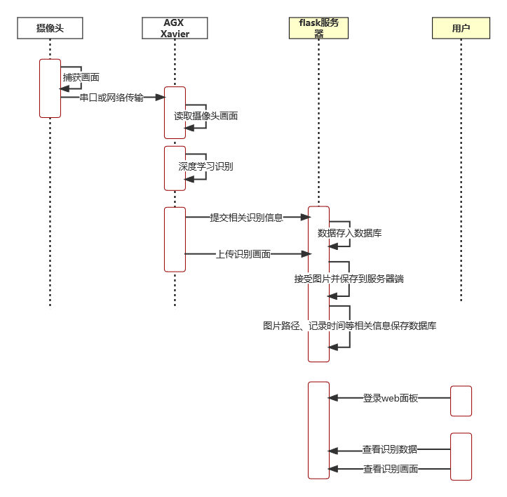
### 算法demo汇总.png
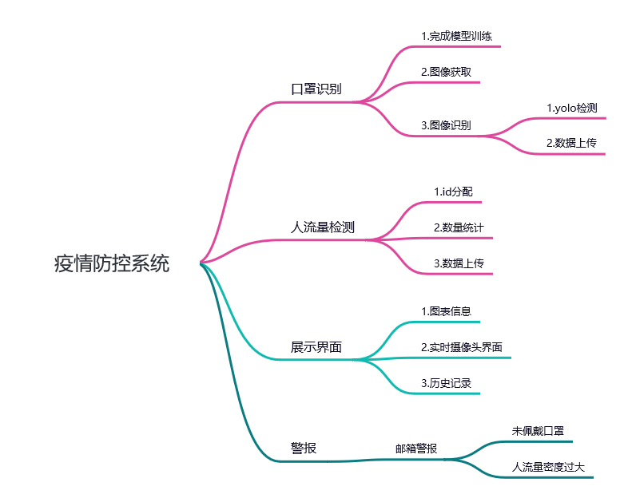
### 系统架构图.png
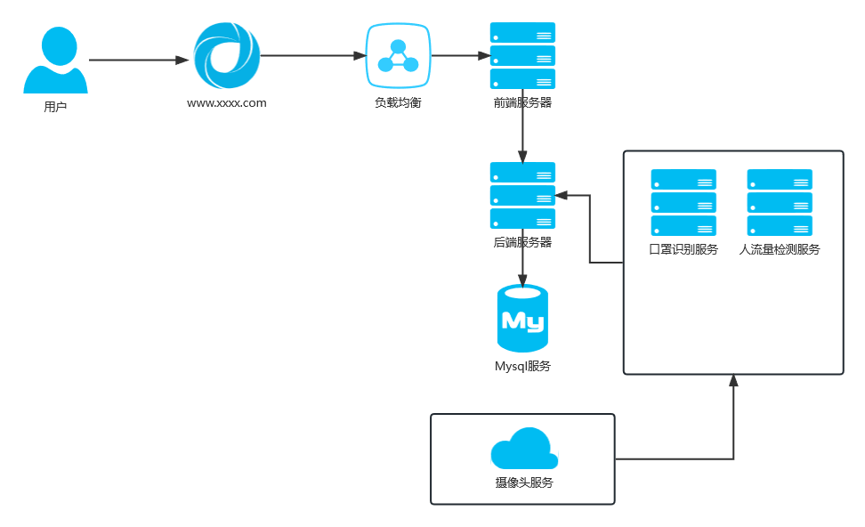
### 系统用例图.png
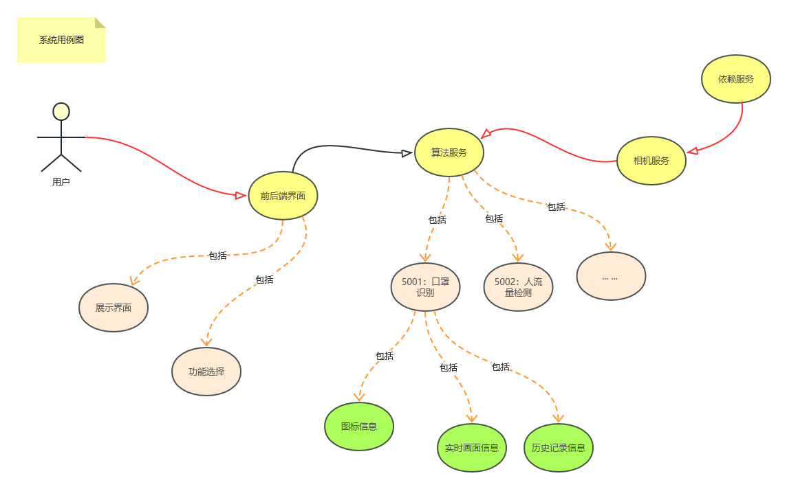

# 项目目录
### ./camera_services
相机服务，相机服务读取摄像头发布图片画面
### ./web
web端界面
### ./yolo
口罩识别
### ./deepsort
人流量检测